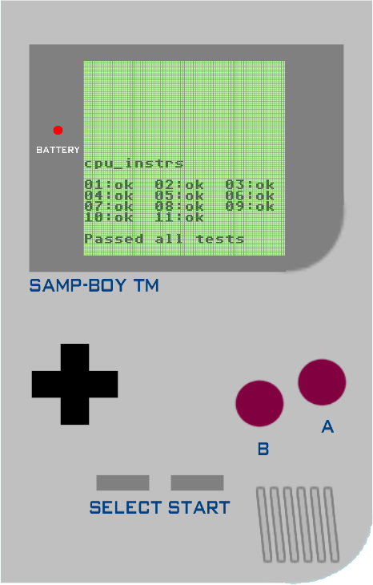
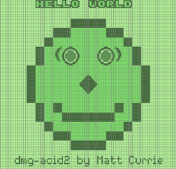
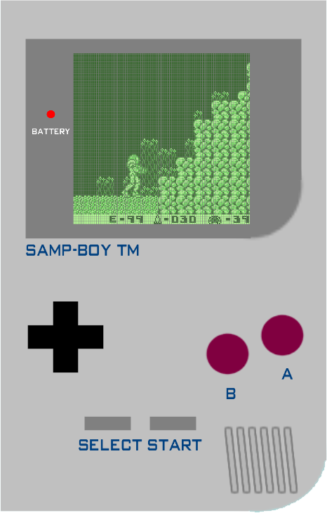
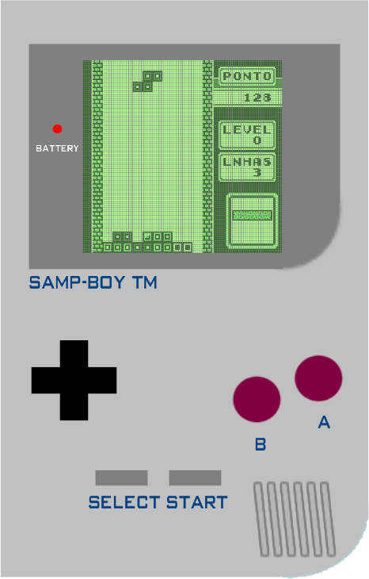

## English
# SAMPBOY - GameBoy Emulator for open.mp (W.I.P)

### Description
SAMPBOY is a unique GameBoy emulator for open.mp. It is written in Pawn using TextDraws to simulate the GameBoy display.
> **Important:** Not recommended on a hosting server - the emulator fires a timer every 1ms with heavy CPU work, leaving the server no time to process network packets. Players will experience lag and disconnects. **Test on a local server only.**
### Screenshots
| | |
|---|---|
|  |  |
|  |  |
### Commands
- `/startgb` - Turns on the GameBoy emulator.
- `/stopgb` - Turns off the emulator.
- `/resetgb` - Resets the emulator.
- `/keys_control` - Keyboard control.
### Credits
The emulator is based on [brickboy by maxpoletaev](https://github.com/maxpoletaev/brickboy).

---
## Russian
# SAMPBOY - Эмулятор GameBoy для open.mp (W.I.P)

### Описание
SAMPBOY - это уникальный эмулятор геймбоя для open.mp. Написан на Pawn с использованием TextDraw для имитации экрана геймбоя.
> **Важно:** Не рекомендуется запускать на хостинге - эмулятор срабатывает каждую миллисекунду и нагружает сервер настолько, что пакеты не успевают обрабатываться. Игроки будут испытывать лаги и дисконнекты. **Тестировать только на локальном сервере.**
### Скриншоты
| | |
|---|---|
|  |  |
|  |  |
### Команды
- `/startgb` - Включает эмулятор геймбоя.
- `/stopgb` - Останавливает эмулятор.
- `/resetgb` - Сбрасывает эмулятор.
- `/keys_control` - Управление с клавиатуры.
### Credits
Эмулятор базируется на [brickboy от maxpoletaev](https://github.com/maxpoletaev/brickboy).
